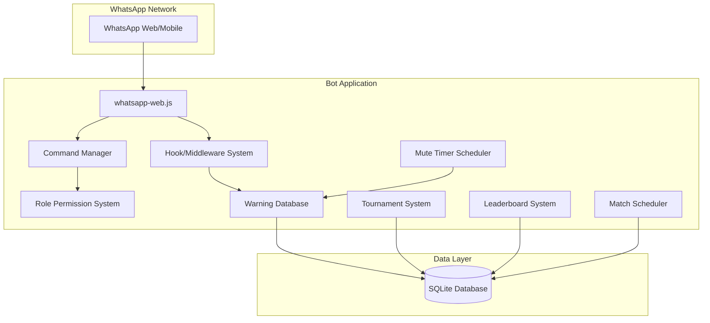

# WhatsApp eFootball Group Management Bot - Technical Specification

## 1. Technology Stack Recommendation

### Core Technologies

| Component | Technology | Reason |
|-----------|------------|--------|
| **WhatsApp Client** | `whatsapp-web.js` (Baileys) | Most popular Node.js library, supports WhatsApp Web, actively maintained |
| **Runtime** | Node.js 18+ | JavaScript/TypeScript ecosystem, async-first |
| **Language** | TypeScript | Type safety, better maintainability |
| **Database** | SQLite (better-sqlite3) | Simple, file-based, no external server needed |
| **Command Handler** | Custom command parser | Clean command parsing |
| **Scheduler** | node-cron | For mute timer and match reminders |
| **Image Processing** | sharp | For generating leaderboard images |

### Alternative Options

- **WhatsApp Business API** - More enterprise-focused, requires Facebook approval
- **Twilio WhatsApp API** - Paid, but reliable for production
- **Venom Bot** - Another popular option, but less maintained

**Recommendation**: Use `whatsapp-web.js` with Baileys for free, self-hosted solution.

---

## 2. System Architecture



---

## 3. Feature Specifications

### 3.1 Role-Based System

| Role | Permissions |
|------|-------------|
| **Owner** | Full control, can add/remove admins, manage all settings |
| **Admin** | Can warn, mute, kick members, manage warnings, manage tournaments |
| **Moderator** | Can warn members, limited mute capability, manage matches |
| **Member** | Standard group member, can be warned/muted, participate in tournaments |

### 3.2 Moderation Features

#### Link Detection & Warning System

**Detection Logic:**
- Regex patterns for common URLs (http, https, www)
- Shortened link detection (bit.ly, t.co, etc.)
- Configurable whitelist (admin-defined domains)
- YouTube/Twitch links (common in gaming groups)

**Warning Flow:**
```
User sends link
    ↓
Bot detects link
    ↓
Check user role (Admin/Mod exempt)
    ↓
Increment warning count
    ↓
Send warning message to user
    ↓
If warnings >= 3:
    ↓
Mute user for 2 hours
    ↓
Reset warnings after mute expires
```

#### Mute System

- **Duration**: 2 hours (configurable by admin)
- **Implementation**: Bot monitors messages, removes send permission concept
- **Auto-unmute**: Timer-based using node-cron
- **Manual unmute**: Admin can unmute early

### 3.3 eFootball Features

#### 3.3.1 Tournament System

| Feature | Description |
|---------|-------------|
| **Create Tournament** | `!tourney create [name] [type]` - Single elimination, double elimination, round robin |
| **Join Tournament** | `!tourney join` - Register for active tournament |
| **Set Match Result** | `!tourney result [score]` - Report match outcome |
| **View Bracket** | `!tourney bracket` - Display tournament bracket |
| **Tournament Status** | `!tourney status` - Show current matches |

#### 3.3.2 Player Statistics & Leaderboard

| Feature | Description |
|---------|-------------|
| **Track Stats** | Wins, losses, goals scored, goals conceded |
| **Leaderboard** | `!leaderboard` or `!rank` - Show top players |
| **Player Profile** | `!profile @user` - View detailed stats |
| **Weekly Stats** | `!stats weekly` - Weekly performance |
| **Season Stats** | `!stats season` - Full season statistics |

#### 3.3.3 Match Scheduling

| Feature | Description |
|---------|-------------|
| **Schedule Match** | `!match [opponent] [date/time]` - Set up a match |
| **My Matches** | `!matches` - View upcoming matches |
| **Match Reminder** | Automatic reminder before scheduled matches |
| **Cancel Match** | `!match cancel` - Cancel scheduled match |
| **Accept Match** | `!match accept` - Accept a match challenge |

#### 3.3.4 Team/Formation Sharing

| Feature | Description |
|---------|-------------|
| **Share Formation** | `!formation [formation-name]` - Post your team formation |
| **Vote Formation** | React to best formations |
| **Top Formations** | `!formations` - Most popular formations |

#### 3.3.5 Daily Challenges

| Feature | Description |
|---------|-------------|
| **Daily Challenge** | Auto-post daily challenge (e.g., "Win with 1-star team") |
| **Submit Proof** | `!challenge submit` - Submit challenge completion |
| **Challenge Leaderboard** | `!challenge top` - Best challenge completers |

#### 3.3.6 Polls & Voting

| Feature | Description |
|---------|-------------|
| **Create Poll** | `!poll [question] [option1] [option2]...` |
| **Vote** | `!vote [option]` - Vote in active poll |
| **Poll Results** | Auto-show results when poll ends |

#### 3.3.7 Event Notifications

| Feature | Description |
|---------|-------------|
| **eFootball Events** | Auto-post new eFootball events |
| **Update Alerts** | Notify about game updates |
| **New Player Cards** | Announce new player card releases |

### 3.4 Commands

#### Moderation Commands

| Command | Description | Access |
|---------|-------------|--------|
| `!warn @user` | Warn a user | Admin+ |
| `!warnings @user` | Check user's warnings | Admin+ |
| `!mute @user [duration]` | Mute a user | Admin+ |
| `!unmute @user` | Unmute a user | Admin+ |
| `!kick @user` | Remove from group | Admin+ |
| `!promote @user` | Make user moderator | Owner |
| `!demote @user` | Remove moderator | Owner |
| `!setadmin @user` | Make user admin | Owner |
| `!settings` | View bot settings | Admin+ |
| `!help` | Show help menu | All |

#### Tournament Commands

| Command | Description | Access |
|---------|-------------|--------|
| `!tourney create [name] [type]` | Create tournament | Admin+ |
| `!tourney join` | Join tournament | All |
| `!tourney leave` | Leave tournament | All |
| `!tourney bracket` | View bracket | All |
| `!tourney result [score]` | Report result | All |
| `!tourney status` | Tournament status | All |

#### Stats & Leaderboard Commands

| Command | Description | Access |
|---------|-------------|--------|
| `!leaderboard` | View top players | All |
| `!rank` | Your rank | All |
| `!profile @user` | View player profile | All |
| `!stats` | Your stats | All |
| `!stats weekly` | Weekly stats | All |

#### Match Commands

| Command | Description | Access |
|---------|-------------|--------|
| `!match [opponent] [time]` | Schedule match | All |
| `!matches` | View upcoming matches | All |
| `!match accept` | Accept match challenge | All |
| `!match cancel` | Cancel match | All |

#### Fun Commands

| Command | Description | Access |
|---------|-------------|--------|
| `!formation [name]` | Share formation | All |
| `!formations` | Popular formations | All |
| `!challenge` | View daily challenge | All |
| `!challenge submit` | Submit challenge | All |
| `!poll [question] [opts...]` | Create poll | Mod+ |
| `!vote [option]` | Vote in poll | All |

---

## 4. Database Schema

### Users Table
```sql
CREATE TABLE users (
    id INTEGER PRIMARY KEY AUTOINCREMENT,
    jid TEXT UNIQUE NOT NULL,
    name TEXT,
    role TEXT DEFAULT 'member',
    warnings INTEGER DEFAULT 0,
    is_muted INTEGER DEFAULT 0,
    mute_expires_at DATETIME,
    created_at DATETIME DEFAULT CURRENT_TIMESTAMP
);
```

### Player Stats Table
```sql
CREATE TABLE player_stats (
    id INTEGER PRIMARY KEY AUTOINCREMENT,
    user_jid TEXT UNIQUE NOT NULL,
    wins INTEGER DEFAULT 0,
    losses INTEGER DEFAULT 0,
    draws INTEGER DEFAULT 0,
    goals_scored INTEGER DEFAULT 0,
    goals_conceded INTEGER DEFAULT 0,
    tournaments_won INTEGER DEFAULT 0,
    tournaments_played INTEGER DEFAULT 0,
    challenge_completed INTEGER DEFAULT 0,
    updated_at DATETIME DEFAULT CURRENT_TIMESTAMP
);
```

### Tournaments Table
```sql
CREATE TABLE tournaments (
    id INTEGER PRIMARY KEY AUTOINCREMENT,
    name TEXT NOT NULL,
    type TEXT NOT NULL,
    status TEXT DEFAULT 'setup',
    max_players INTEGER,
    created_by TEXT,
    created_at DATETIME DEFAULT CURRENT_TIMESTAMP,
    started_at DATETIME,
    ended_at DATETIME
);
```

### Tournament Participants Table
```sql
CREATE TABLE tournament_participants (
    id INTEGER PRIMARY KEY AUTOINCREMENT,
    tournament_id INTEGER,
    user_jid TEXT,
    status TEXT DEFAULT 'registered',
    seed INTEGER,
    FOREIGN KEY (tournament_id) REFERENCES tournaments(id)
);
```

### Tournament Matches Table
```sql
CREATE TABLE tournament_matches (
    id INTEGER PRIMARY KEY AUTOINCREMENT,
    tournament_id INTEGER,
    player1_jid TEXT,
    player2_jid TEXT,
    player1_score INTEGER,
    player2_score INTEGER,
    winner_jid TEXT,
    round_number INTEGER,
    match_number INTEGER,
    status TEXT DEFAULT 'pending',
    scheduled_at DATETIME,
    FOREIGN KEY (tournament_id) REFERENCES tournaments(id)
);
```

### Scheduled Matches Table
```sql
CREATE TABLE scheduled_matches (
    id INTEGER PRIMARY KEY AUTOINCREMENT,
    challenger_jid TEXT,
    opponent_jid TEXT,
    scheduled_at DATETIME,
    status TEXT DEFAULT 'pending',
    created_at DATETIME DEFAULT CURRENT_TIMESTAMP
);
```

### Polls Table
```sql
CREATE TABLE polls (
    id INTEGER PRIMARY KEY AUTOINCREMENT,
    question TEXT NOT NULL,
    options TEXT,
    votes TEXT,
    created_by TEXT,
    ends_at DATETIME,
    created_at DATETIME DEFAULT CURRENT_TIMESTAMP
);
```

### Daily Challenges Table
```sql
CREATE TABLE daily_challenges (
    id INTEGER PRIMARY KEY AUTOINCREMENT,
    challenge TEXT NOT NULL,
    description TEXT,
    date DATE UNIQUE,
    created_at DATETIME DEFAULT CURRENT_TIMESTAMP
);
```

### Challenge Submissions Table
```sql
CREATE TABLE challenge_submissions (
    id INTEGER PRIMARY KEY AUTOINCREMENT,
    challenge_id INTEGER,
    user_jid TEXT,
    proof TEXT,
    status TEXT DEFAULT 'pending',
    submitted_at DATETIME DEFAULT CURRENT_TIMESTAMP,
    FOREIGN KEY (challenge_id) REFERENCES daily_challenges(id)
);
```

### Settings Table
```sql
CREATE TABLE settings (
    key TEXT PRIMARY KEY,
    value TEXT
);
```

### Logs Table
```sql
CREATE TABLE logs (
    id INTEGER PRIMARY KEY AUTOINCREMENT,
    action TEXT NOT NULL,
    user_jid TEXT,
    target_jid TEXT,
    details TEXT,
    created_at DATETIME DEFAULT CURRENT_TIMESTAMP
);
```

---

## 5. Project Structure

```
whatsappbot/
├── src/
│   ├── index.ts
│   ├── client.ts
│   ├── database/
│   │   ├── db.ts
│   │   └── migrations.ts
│   ├── handlers/
│   │   ├── message.ts
│   │   ├── commands.ts
│   │   └── link-detector.ts
│   ├── commands/
│   │   ├── moderation/
│   │   │   ├── warn.ts
│   │   │   ├── mute.ts
│   │   │   ├── kick.ts
│   │   │   └── promote.ts
│   │   ├── tournament/
│   │   │   ├── create.ts
│   │   │   ├── join.ts
│   │   │   └── bracket.ts
│   │   ├── stats/
│   │   │   ├── leaderboard.ts
│   │   │   └── profile.ts
│   │   ├── match/
│   │   │   ├── schedule.ts
│   │   │   └── list.ts
│   │   └── fun/
│   │       ├── poll.ts
│   │       ├── challenge.ts
│   │       └── formation.ts
│   ├── services/
│   │   ├── role-manager.ts
│   │   ├── warn-manager.ts
│   │   ├── mute-manager.ts
│   │   ├── tournament-manager.ts
│   │   ├── stats-manager.ts
│   │   ├── match-scheduler.ts
│   │   └── challenge-manager.ts
│   ├── utils/
│   │   ├── config.ts
│   │   └── helpers.ts
│   └── types/
│       └── index.ts
├── data/
├── sessions/
├── package.json
├── tsconfig.json
└── .env
```

---

## 6. Implementation Steps

1. **Setup Project**
   - Initialize Node.js project with TypeScript
   - Install dependencies
   - Configure TypeScript

2. **Database Layer**
   - Set up SQLite database
   - Create all migrations
   - Implement data access functions

3. **WhatsApp Client**
   - Initialize whatsapp-web.js
   - Handle authentication
   - Set up session persistence

4. **Core Systems**
   - Role permission system
   - Command handler
   - Link detector

5. **Moderation Features**
   - Warning system
   - Mute system with auto-unmute

6. **eFootball Features**
   - Tournament system
   - Player stats & leaderboard
   - Match scheduling
   - Daily challenges
   - Polls & voting

7. **Testing & Deployment**
   - Test in development group
   - Deploy to production

---

## 7. Key Considerations

### Pros
- Free to use (whatsapp-web.js)
- Full control over features
- Active community support
- Easy to customize
- Perfect for gaming communities

### Cons
- Requires phone to be online
- May get rate-limited
- Not official WhatsApp Business API

### Requirements
- Always-on server (VPS/Cloud)
- Phone must stay connected
- Proper session management

---

## 8. Next Steps

Once you approve this plan, I can proceed to implement the bot in Code mode. The implementation will include:

1. Project setup with all dependencies
2. Complete database schema
3. WhatsApp client with session persistence
4. Role-based permission system
5. Link detection with warning system (3 warnings = 2hr mute)
6. Tournament system (create, join, bracket, results)
7. Player statistics & leaderboard
8. Match scheduling with reminders
9. Daily challenges
10. Polls & voting system
11. All admin/moderator commands

Would you like me to proceed with the implementation?
